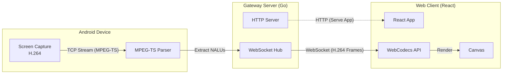

# LudicrousLink - Low-Latency Android Screen Streaming

[](https://github.com/1n4001/ludicrouslink/actions/workflows/ci.yml) 

A complete system for real-time screen streaming from Android devices to web browsers over a local network.

## Quick Start

### Prerequisites
- **Android**: Android 10+ Device
- **Host**: Windows/Linux/macOS with:
  - Java 17+ (for Gradle)
  - Go 1.22+
  - Node.js 20+ (optional, Gradle can manage it)

### Running the Server
The project is a monorepo managed by Gradle. You can run the entire backend stack (which serves the frontend) with a single command:

```bash
# Windows
./gradlew runBackend

# Linux/Mac
./gradlew runBackend
```

This command will:
1. Build the React Frontend (`frontend/`)
2. Copy assets to the Backend (`backend/public/`)
3. Compile and Run the Go Backend (`backend/`)

Once running, access the web client at: **http://localhost:8080**

### android App
Build and install the Android app:
```bash
./gradlew :ludicrouslinkAndroid:app:installDebug
```

## System Architecture (v3)



### Improvements in v3
- **Frontend**: Ported to **React + Vite** + TypeScript. Uses **WebCodecs API** for hardware-accelerated H.264 decoding in the browser.
- **Backend**: Rewritten in **Go**. High-performance, concurrent handling of TCP streams and WebSocket broadcasting. Replaces Python/GStreamer.
- **Build**: Unified **Gradle** build system. No manual `pip` or `npm` commands required for standard execution.

## Project Structure

```
ludicrouslink/
├── ludicrouslinkAndroid/     # Android application (Kotlin)
├── frontend/             # Web Client (React, Vite, TypeScript)
├── backend/              # Gateway Server (Go)
├── build.gradle.kts      # Root build configuration
└── settings.gradle.kts   # Project definitions
```

## Features

- **Low Latency** - Direct H.264 NAL unit forwarding.
- **High Performance** - Go backend efficiently handles multiple clients.
- **Modern Web UI** - React-based interface with connection stats (FPS, Latency).
- **Auto-Discovery** - mDNS (Zeroconf) support for easy connection.

## Development

### Frontend
```bash
cd frontend
npm run dev
```

### Backend
```bash
cd backend
go run .
```

### Android
Open `ludicrouslinkAndroid` in Android Studio or use Gradle tasks at the root:
```bash
./gradlew :ludicrouslinkAndroid:app:assembleDebug
```
