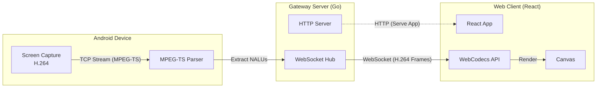
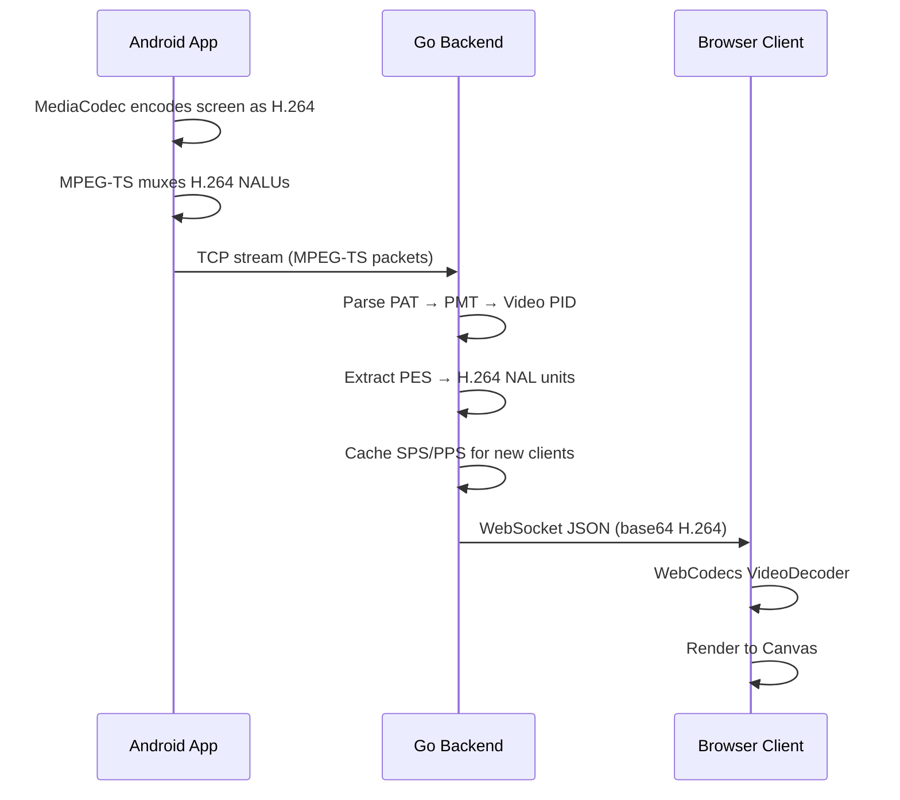

# Architecture

## System Overview

HStreamer consists of three main components that work together to deliver a real-time screen streaming experience.

## Data Flow

The streaming pipeline is designed for minimal latency:

## Design Decisions

| Decision | Rationale |
|----------|-----------|
| **TCP** (not UDP) | Simplicity and reliability on local networks. Android `MediaCodec` feeds directly into a TCP socket. |
| **MPEG-TS** container | Industry-standard for H.264 transport. Provides PID-based stream multiplexing. |
| **Go backend** | Excellent concurrency primitives (goroutines/channels) map naturally to the hub-and-spoke pattern. |
| **WebCodecs API** | Hardware-accelerated H.264 decoding in the browser, much lower latency than MSE or WASM decoders. |
| **Base64 over WebSocket** | WebSocket text frames with JSON allow structured metadata (frame type, codec info) alongside the payload. |

## Component Responsibilities

| Component | Language | Role |
|-----------|----------|------|
| `hstreamerAndroid` | Kotlin | Captures screen via `MediaProjection`, encodes H.264, muxes to MPEG-TS, sends over TCP |
| `backend` | Go | Receives TCP stream, parses MPEG-TS, broadcasts H.264 frames via WebSocket, serves frontend |
| `frontend` | React/TS | Connects via WebSocket, decodes H.264 with WebCodecs, renders to Canvas |
