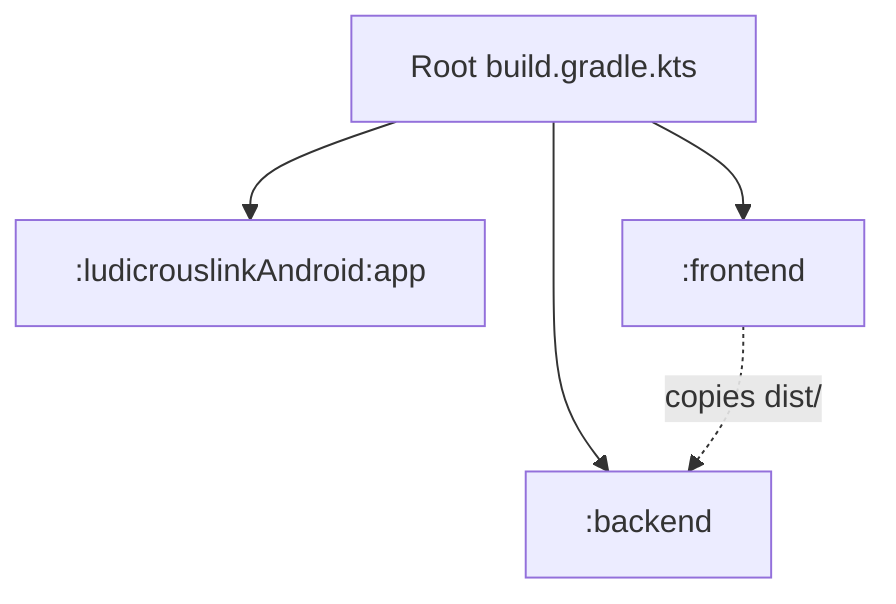

# Build System

LudicrousLink uses a **Gradle monorepo** to orchestrate builds across three different technology stacks: Android (Kotlin), Frontend (Node.js/React), and Backend (Go).

## Project Layout



## Settings

`settings.gradle.kts` declares all subprojects:

```kotlin
rootProject.name = "ludicrouslink"
include(":ludicrouslinkAndroid")
include(":ludicrouslinkAndroid:app")
include(":frontend")
include(":backend")
```

## Subproject Build Files

### `frontend/build.gradle.kts`

Uses the [`com.github.node-gradle.node`](https://github.com/node-gradle/gradle-node-plugin) plugin:

- Automatically downloads **Node.js 20.10.0** and **npm 10.2.3**.
- Exposes `npm_run_build` task which runs `npm run build`.
- No system-wide Node.js installation required.

### `backend/build.gradle.kts`

Custom tasks to build the Go binary:

- **`copyFrontend`** — Copies `frontend/dist/` to `backend/public/`. Depends on `:frontend:npm_run_build`.
- **`goModTidy`** — Runs `go mod tidy` to keep dependencies clean.
- **`goBuild`** — Runs `go build` to compile the server binary. Depends on `copyFrontend` and `goModTidy`.
- **`run`** — Executes the compiled binary. Depends on `goBuild`.

### Root `build.gradle.kts`

Provides top-level convenience tasks:

| Task | Description |
|------|-------------|
| `buildAll` | Builds everything (frontend + backend + Android APK) |
| `runBackend` | Builds and runs the backend (includes frontend) |
| `setupAndroidSdk` | Downloads and configures Android SDK on Windows |

## Common Commands

```bash
# Build and run the full stack
./gradlew runBackend

# Build everything (including Android APK)
./gradlew buildAll

# Build only the frontend
./gradlew :frontend:npm_run_build

# Build only the backend
./gradlew :backend:build

# Build only the Android APK
./gradlew :ludicrouslinkAndroid:app:assembleDebug

# Set up Android SDK (Windows only)
./gradlew setupAndroidSdk
```
