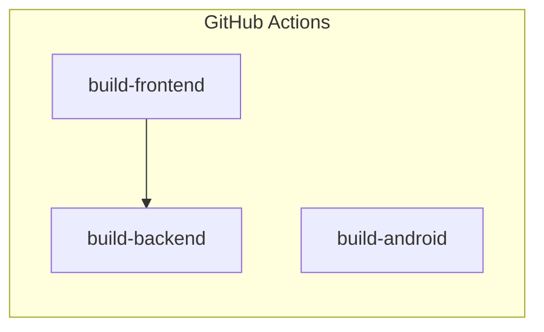

# CI/CD

HStreamer uses **GitHub Actions** for continuous integration. The workflow runs on every push to `main` and on pull requests.

## Workflow Overview

The pipeline has three jobs, with `build-backend` depending on `build-frontend` for the compiled assets.

## Jobs

### `build-frontend`

| Property | Value |
|----------|-------|
| Runner | `ubuntu-latest` |
| Node.js | 20 |
| Cache | npm (`frontend/package-lock.json`) |

Steps:

1. Checkout code.
2. Setup Node.js with npm caching.
3. `npm ci` — install dependencies.
4. `npm run build` — compile the React app.
5. Upload `frontend/dist/` as an artifact.

### `build-backend`

| Property | Value |
|----------|-------|
| Runner | `ubuntu-latest` |
| Go | 1.22 |
| Depends on | `build-frontend` |

Runs as a **matrix build** producing binaries for multiple platforms:

| Target | GOOS | GOARCH | Output |
|--------|------|--------|--------|
| Linux x64 | `linux` | `amd64` | `hstreamer-linux-amd64` |
| Linux ARM64 | `linux` | `arm64` | `hstreamer-linux-arm64` |
| Linux ARM | `linux` | `arm` | `hstreamer-linux-arm` |
| Windows x64 | `windows` | `amd64` | `hstreamer-windows-amd64.exe` |
| Windows ARM64 | `windows` | `arm64` | `hstreamer-windows-arm64.exe` |
| macOS ARM | `darwin` | `arm64` | `hstreamer-darwin-arm64` |

Steps:

1. Checkout code.
2. Setup Go with module caching.
3. Download the `frontend-dist` artifact into `backend/public/`.
4. Cross-compile with `CGO_ENABLED=0`.
5. Upload the binary as an artifact.

### `build-android`

| Property | Value |
|----------|-------|
| Runner | `ubuntu-latest` |
| JDK | 17 (Temurin) |
| Android SDK | via `android-actions/setup-android@v3` |

Steps:

1. Checkout code.
2. Setup JDK and Android SDK.
3. `./gradlew :hstreamerAndroid:app:assembleDebug`
4. Upload APK as an artifact.

## Artifacts

After a successful run, the following artifacts are downloadable from the GitHub Actions UI:

- `frontend-dist` — Compiled React app
- `hstreamer-linux-amd64` — Linux x64 binary
- `hstreamer-linux-arm64` — Linux ARM64 binary
- `hstreamer-linux-arm` — Linux ARM binary
- `hstreamer-windows-amd64.exe` — Windows x64 binary
- `hstreamer-windows-arm64.exe` — Windows ARM64 binary
- `hstreamer-darwin-arm64` — macOS ARM binary
- `hstreamer-debug` — Android debug APK
