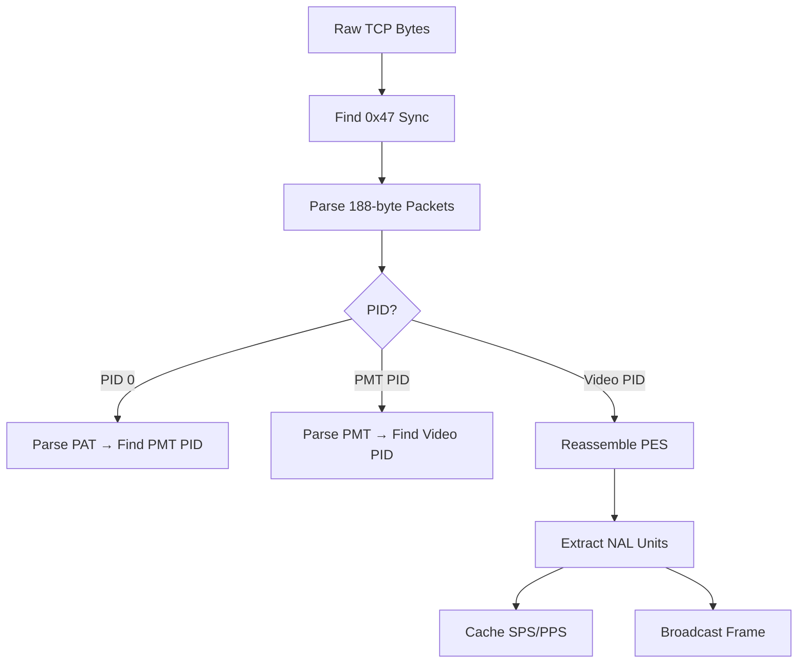

# Backend (Go)

The Go backend is the central gateway server. It receives the MPEG-TS stream from the Android app, parses it, and broadcasts H.264 frames to connected browser clients via WebSocket. It also serves the React frontend as static files.

## Source Structure

```
backend/
├── main.go              # Entry point, HTTP server, TCP listener
├── go.mod / go.sum      # Go module definition
└── pkg/
    ├── hub/
    │   └── hub.go       # WebSocket client management and broadcasting
    ├── mpegts/
    │   └── parser.go    # MPEG-TS demuxer and H.264 NAL unit extractor
    └── discovery/
        └── mdns.go      # mDNS (Zeroconf) service advertisement
```

## Packages

### `main`

Orchestrates all components:

1. Initializes the WebSocket hub.
2. Creates the MPEG-TS parser with a video frame callback.
3. Starts a TCP listener for incoming streams.
4. Serves the frontend from `./public`.
5. Registers the `/ws` WebSocket endpoint.
6. Starts mDNS service advertisement.
7. Starts the HTTP(S) server.

### `pkg/hub`

The hub manages real-time communication with browser clients.

- **`Hub`** — Maintains a set of active `Client` connections. Uses Go channels for register/unregister/broadcast operations.
- **`Client`** — Represents a single WebSocket connection with read and write goroutines.
- **Codec caching** — Stores SPS/PPS data and sends it to newly connected clients so they can immediately initialize their decoders.

### `pkg/mpegts`

A custom MPEG-TS parser that processes the raw TCP byte stream:



Key features:

- PAT/PMT parsing to discover stream PIDs dynamically.
- PES reassembly across multiple TS packets.
- NAL unit extraction with start code detection (`00 00 01` and `00 00 00 01`).
- SPS/PPS caching for codec initialization.

### `pkg/discovery`

Advertises the gateway via mDNS using the `grandcat/zeroconf` library:

- Service type: `_http._tcp`
- Instance name: `LudicrousLink Gateway`
- Automatically advertises the configured HTTP port.

## Dependencies

| Package | Version | Purpose |
|---------|---------|---------|
| `gorilla/websocket` | v1.5.3 | WebSocket server |
| `grandcat/zeroconf` | v1.0.0 | mDNS service advertisement |

## WebSocket Protocol

Messages are JSON text frames:

=== "codec-info"

    Sent to newly connected clients:
    ```json
    {
      "type": "codec-info",
      "video": "h264",
      "sps": "<base64>",
      "pps": "<base64>"
    }
    ```

=== "video-frame-h264"

    Sent for each decoded video frame:
    ```json
    {
      "type": "video-frame-h264",
      "data": "<base64 H.264 NAL units>",
      "keyFrame": true
    }
    ```
